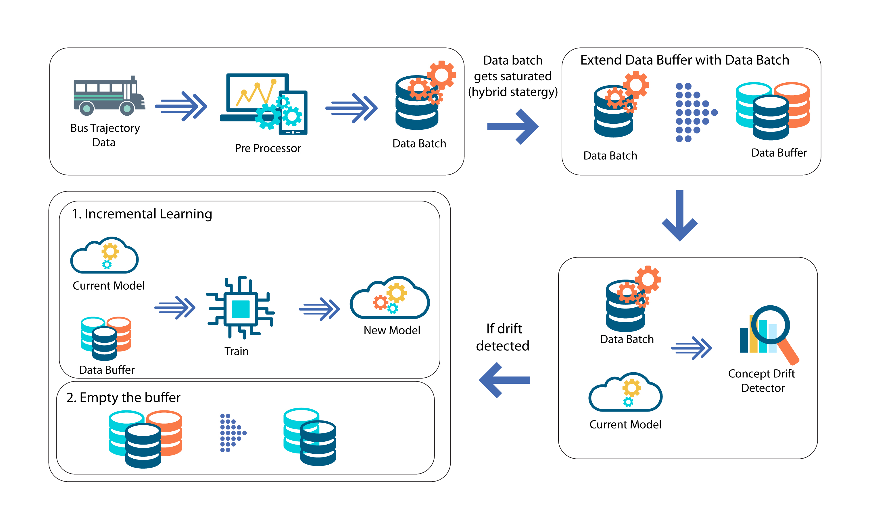

# Robust BDT prediction

![project] ![research]

- <b>Project Leads / Mentors</b>
    1. Dr. T. Uthayasanker
    2. R. Shiveswarran
- <b>Contributors</b>
    1. S. Kajanan
    2. A. Kesavi
    3. S. Gopinath

## Summary

Robust bus dwell time prediction by handling real concept drift.

## Description

Improve the robustness of the bus dwell time prediction model in heterogeneous traffic conditions by detecting the concept drift in real-time that exists in the time series bus dwell time data due to various factors such as weather changes, traffic, industrial impacts, road management, and sudden accidents, etc., followed by adapting the model to quickly learn from drift samples within a short period by introducing a novel batch processing approach employing incremental learning with an active strategy into that BDT model.​

## Objectives

- To survey, identify, and develop a comprehensive suite of concept drift detection algorithms tailored to our research.​
- To survey and identify a robust suite of incremental learning algorithm to address real-time bus dwell time prediction challenges.​
- To identify and develop suitable evaluation metrics for our specific context.​
- To develop a framework to assess the impact of incremental learning algorithms along with different batch processing and concept drift handling strategies on bus dwell time prediction.​
- To identify the optimal combination of batch processing and concept drift handling strategy to achieve a significant reduction in mean absolute error (MAE) compared to the base model.

## System overview

## License

MIT [[See here](https://github.com/kajanan1212/robust-bdt-prediction/blob/master/LICENSE)]

[project]: https://img.shields.io/badge/-Project-blue
[research]: https://img.shields.io/badge/-Research-yellowgreen
